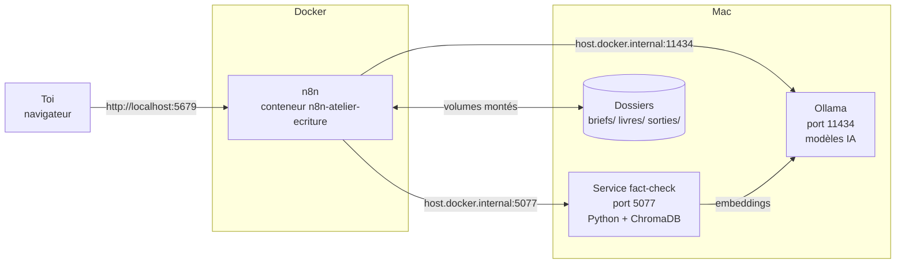
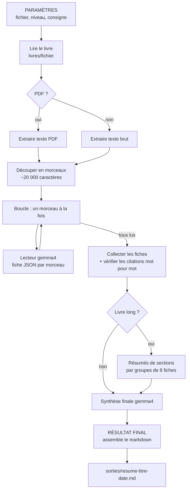
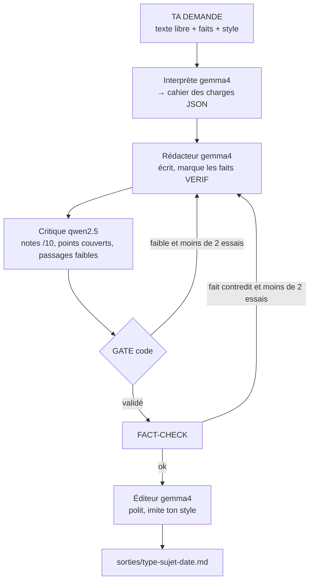
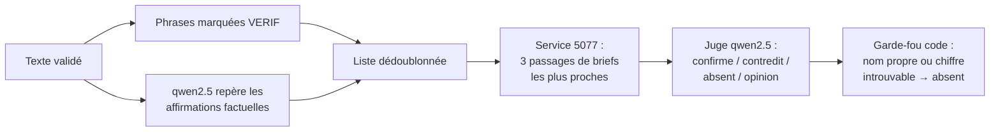
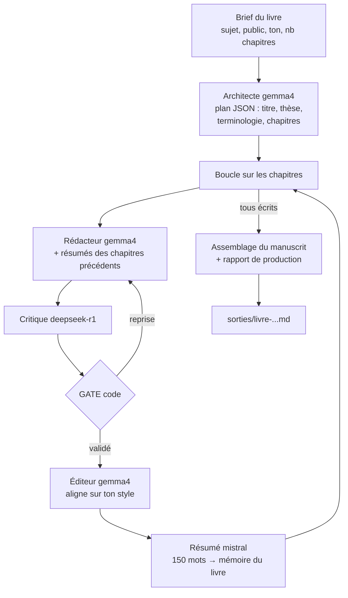

# Architecture — comment l'atelier est monté

Ce document explique **ce qui se passe réellement** quand on clique sur « Execute workflow ».
Objectif : pouvoir l'expliquer à quelqu'un sans ouvrir n8n.

---

## 1. Vue d'ensemble



**Trois points clés :**

1. **n8n vit dans Docker, Ollama vit sur le Mac.** Depuis l'intérieur du conteneur, le Mac s'appelle
   `host.docker.internal`. C'est pourquoi tous les appels aux modèles vont vers
   `http://host.docker.internal:11434/api/generate`.
2. **Les dossiers du Mac sont « montés » dans le conteneur** (voir `docker-compose-n8n-atelier.yml`) :

   | Sur le Mac (dans ce dépôt) | Dans le conteneur | Usage |
   |---|---|---|
   | `./briefs` | `/home/node/briefs` | faits de référence |
   | `./livres` | `/home/node/livres` | livres à résumer |
   | `./sorties` | `/home/node/sorties` | textes produits |

   n8n 2.x interdit par défaut de lire/écrire des fichiers hors de son dossier interne :
   la variable `N8N_RESTRICT_FILE_ACCESS_TO` autorise explicitement ces trois dossiers.
3. **Tout est exposé uniquement sur la machine** (`127.0.0.1`) : ni n8n, ni Ollama, ni le fact-check
   ne sont joignables depuis le réseau.

### Les modèles utilisés

| Modèle Ollama | Taille | Rôle dans l'atelier |
|---|---|---|
| `gemma4:e4b` | ~10 Go | Interprète, Rédacteur, Éditeur, Architecte, Lecteur et Synthèse (résumé) |
| `qwen2.5:7b` | ~5 Go | Critique et juge du fact-check (Express) |
| `deepseek-r1:7b` | ~5 Go | Critique (Livre complet, Test 1) |
| `mistral:7b` | ~4 Go | Résumé de chapitre pour la mémoire du livre (Livre complet) |
| `nomic-embed-text` | ~0,3 Go | Transforme les phrases en vecteurs pour la recherche dans les briefs |

**Pourquoi des modèles différents ?** Un critique d'une autre « famille » que le rédacteur
juge plus sévèrement : il ne partage pas ses tics d'écriture.

### Le principe qui revient partout : IA + code

Chaque appel à un modèle suit le même schéma en 3 nodes :

```
[Préparer requête X]  →  [Ollama — X]  →  [node de code qui lit / contrôle la réponse]
  (code JavaScript :       (requête HTTP     (parse le JSON, vérifie, décide)
   consignes + données)     vers Ollama)
```

- Les **consignes** (le « system prompt ») sont écrites dans le node « Préparer requête ».
  C'est là qu'on modifie le comportement d'un rôle.
- Quand on attend une réponse structurée, on impose à Ollama un **schéma JSON**
  (paramètre `format`) : le modèle ne *peut* pas répondre autrement.
- Les décisions importantes (valider, réécrire, rejeter une citation) sont prises par du **code**,
  jamais par l'IA seule.

---

## 2. Workflow 01 — Atelier Lecture : résumé de livre



**Étape par étape :**

1. **Lecture du fichier** : PDF (s'il contient du texte, pas un scan), TXT ou MD.
2. **Découpage** en morceaux d'environ 20 000 caractères, en coupant entre les paragraphes.
   Les en-têtes et licences Project Gutenberg sont retirés automatiquement.
   Si presque aucun texte n'est extrait (PDF scanné), le workflow s'arrête avec un message clair.
3. **Lecture morceau par morceau** : pour chaque morceau, le Lecteur rédige une fiche JSON
   (`resume`, `idees_cles`, `personnages_ou_acteurs`, `citations`). Il ne doit utiliser que l'extrait.
   *Pourquoi une boucle ?* Envoyer tous les morceaux d'un coup ferait attendre Ollama et
   provoquerait des dépassements de délai sur les gros livres.
4. **Vérification des citations (code)** : chaque citation proposée par l'IA est recherchée
   **mot pour mot** dans le texte d'origine. Celles qui sont reformulées ou inventées sont rejetées
   (le nombre de rejets figure dans le rapport).
5. **Synthèse** : si les fiches tiennent dans la mémoire du modèle (< 60 000 caractères), synthèse
   directe. Sinon, étage intermédiaire : résumé de chaque groupe de 8 parties, puis synthèse.
6. **Fichier final** : phrase-clé, résumé, structure, idées clés, personnages, à retenir,
   citations vérifiées, annexe des fiches par partie, rapport de production.

---

## 3. Workflow 02 — Atelier Express (avec fact-checker)



| Rôle | Modèle | Ce qu'il fait |
|---|---|---|
| **Interprète** | gemma4 | Transforme ta demande libre en cahier des charges : type de texte, sujet, objectif, ton, longueur, points clés |
| **Rédacteur** | gemma4 | Écrit le texte ; marque `[VERIF]` après chaque affirmation factuelle ; n'ajoute aucun nom ni chiffre absent du cahier des charges |
| **Critique** | qwen2.5 | Note 5 axes sur 10 (clarté, tenue de l'objectif, format, ton, densité), coche les points clés couverts, cite 3 passages faibles |
| **GATE** | *code* | Valide si : moyenne ≥ 8, aucune note < 5, tous les points couverts, longueur dans la cible, pas de caractères chinois. Sinon renvoie les critiques au Rédacteur (2 essais max) |
| **Fact-Checker** | qwen2.5 + *code* | Voir ci-dessous |
| **Éditeur** | gemma4 | Polit le style sans toucher au fond ; imite ton échantillon de prose s'il est fourni |

### Le Fact-Checker en détail



- **Sources de vérité** : les faits écrits dans **ta demande** + tes **briefs** (dossier `briefs/`,
  indexés dans ChromaDB par `indexer_faits.py`).
- **Verdicts** :
  - `confirme` → rien à faire ;
  - `contredit` → le texte repart au Rédacteur avec la correction à faire ;
  - `absent` → ajouté à la liste `a_verifier_manuellement` (visible dans le node RÉSULTAT FINAL) ;
  - `opinion` → ignoré (ressenti, image littéraire).
- **Garde-fou en code** : si une phrase contient un nom propre ou un chiffre qu'on ne retrouve
  nulle part dans les sources, elle passe en `absent`, même si l'IA disait `confirme`.
  C'est ce qui attrape une invention comme « des modèles comme Llama 3 » quand tu n'en as jamais parlé.
- **Limite** : les inventions vagues, sans nom ni chiffre (« j'ai passé des semaines »), peuvent passer.

### Comment le service fact-check trouve les passages

`indexer_faits.py` découpe chaque brief (chaque ligne de la section « Faits validés » devient
une entrée) et les transforme en **vecteurs** avec `nomic-embed-text`. Quand n8n envoie une phrase à
`verif_service.py`, celle-ci est aussi transformée en vecteur, et ChromaDB renvoie les 3 passages
dont le sens est le plus proche. C'est une recherche **par le sens**, pas par mots-clés.

---

## 4. Workflow 03 — Livre complet



L'astuce : chaque chapitre terminé est **résumé en 150 mots** et gardé en mémoire. Le Rédacteur du
chapitre suivant reçoit ces résumés : il ne se répète pas et respecte les termes déjà définis,
sans devoir relire tout le livre (ce qui dépasserait la mémoire du modèle).

---

## 5. Workflow 04 — Test 1 Chapitre

Version réduite du Livre complet : un seul chapitre avec des données de test écrites à la main
(`Données de test`), puis Rédacteur → Critique → GATE. Sert à essayer un nouveau modèle ou une
nouvelle consigne en 3 minutes avant de l'adopter dans les vrais workflows.

---

## 6. Où modifier quoi

| Je veux… | Où |
|---|---|
| Changer les consignes d'un rôle | node « Préparer requête *Rôle* » → texte `system` |
| Changer de modèle | même node → ligne `model: "..."` (le modèle doit être installé : `ollama pull ...`) |
| Rendre le GATE plus ou moins exigeant | node « GATE » → `moyenne >= 8`, `MAX_ITERATIONS = 2` |
| Ajouter des faits de référence | un fichier `.md` dans `briefs/` puis `cd factcheck && venv/bin/python indexer_faits.py` |
| Changer la taille des morceaux (résumé) | node « Découper en morceaux » → `TAILLE = 20000` |

Après toute modification dans n8n : `./scripts/exporter-workflows.sh` puis `git commit` et `git push`,
pour que le dépôt reste à jour.
